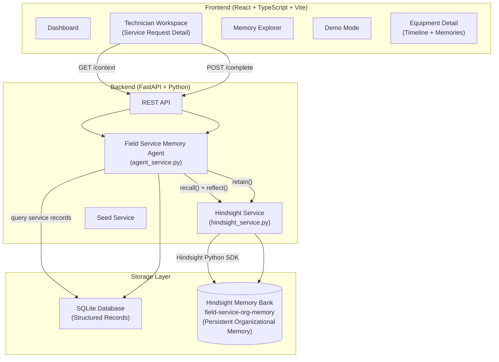

# 🧠 FIELD SERVICE MEMORY
### *The Technician Who Never Forgets.*

> **Preserve field knowledge. Connect past experiences. Give every technician the memory of the organization.**

---

## 🔴 The Problem

Field-service organizations repeatedly send technicians to customer sites, equipment, and facilities. Every visit generates valuable knowledge:

- What the technician observed
- What symptoms occurred and what was tried
- What worked and what failed
- Which parts were replaced and how long the repair lasted
- Unusual equipment behavior and environmental observations

**This knowledge becomes fragmented.** Across service tickets, notes, technicians, PDFs, and disconnected systems.

When another technician arrives months later, they often **treat the problem as new** — even though the organization already solved it before.

> Organizations have service history, but they lack **persistent operational memory** that can understand and reuse that history when a new problem occurs.

---

## 💡 The Solution: Field Service Memory

An intelligent field-service platform where the organization develops **persistent memory** of every service event — and brings that memory to every future technician, automatically.

```
PAST EXPERIENCE
       ↓
HINDSIGHT MEMORY
       ↓
NEW SERVICE ISSUE
       ↓
RELEVANT EXPERIENCE RETRIEVED
       ↓
INFORMED TECHNICIAN ACTION
       ↓
NEW KNOWLEDGE ADDED TO MEMORY
```

The key experience:
> **"I've seen this before."**

---

## 🧬 Why Persistent Memory?

Traditional service management systems store **records** — structured rows of data. They can search keywords. They cannot **understand context**, **recognize patterns**, or **synthesize experience**.

Hindsight enables something fundamentally different:

| Traditional System | Field Service Memory |
|---|---|
| Keyword search over tickets | Semantic retrieval across experiences |
| Raw data rows | Consolidated observations and outcomes |
| You search for it | It retrieves what's relevant |
| Records expire and disconnect | Memories persist and compound |
| Technician starts fresh | Technician starts informed |

---

## 🔌 How Hindsight Is Used

[Hindsight](https://hindsight.vectorize.io/) is the **persistent memory engine** of this application. It is not a decorative integration — it is the core of the product's intelligence.

### Memory Architecture

The application uses a single **Hindsight memory bank** (`field-service-org-memory`) to store and retrieve organizational knowledge. Hindsight's multi-strategy retrieval (semantic, keyword, graph, temporal) means the system finds relevant past experiences even when the current symptoms are described differently.

#### What goes into Hindsight:
- **Technician observations** — natural-language notes from field visits
- **Repair outcomes** — what worked, what failed, how long it lasted
- **Equipment patterns** — recurring symptoms, environmental factors
- **Site context** — access constraints, environmental conditions
- **Resolution knowledge** — successful fixes and their durability

#### What stays in the database:
- Structured records (customers, sites, equipment, service requests)
- User-facing data with known structure (IDs, dates, assignments)
- Records that need filtering and querying (status, priority, assignments)

### Hindsight API Usage

```python
from hindsight_client import Hindsight

client = Hindsight(
    base_url="https://api.hindsight.vectorize.io",
    api_key="your-api-key"
)

# When a service visit is completed:
client.retain(
    bank_id="field-service-org-memory",
    content="Technician Ravi Shankar: HVAC-204 at Hyderabad Plant — compressor vibration detected at startup. Third visit for similar cooling failure. Root cause likely bearing wear. Filter replacement provided only temporary relief. Compressor replacement recommended.",
    tags=["EQUIP-001", "SITE-001", "CUST-001", "cooling", "compressor"]
)

# When a new service request arrives:
results = client.recall(
    bank_id="field-service-org-memory",
    query="HVAC-204 cooling system not maintaining temperature Hyderabad Plant",
    tags=["EQUIP-001"],
    budget="mid"
)

# For deeper synthesis:
insight = client.reflect(
    bank_id="field-service-org-memory",
    query="What is the history and likely root cause of HVAC-204 cooling failures?",
    budget="low"
)
```

---

## 🏗️ System Architecture



### Separation of Concerns

| Concern | Storage |
|---|---|
| Customers, Sites, Equipment, Technicians | SQLite |
| Service Requests, Assignments, Priorities | SQLite |
| Structured Service Records | SQLite |
| Technician observations (natural language) | **Hindsight** |
| Repair outcomes and effectiveness | **Hindsight** |
| Equipment recurring patterns | **Hindsight** |
| Site environmental knowledge | **Hindsight** |
| Cross-incident synthesized insights | **Hindsight** |

---

## 🔄 Memory Lifecycle

```
1. TECHNICIAN COMPLETES VISIT
   └─ Fills out: Observed, Tested, Did, Parts, Outcome, Notes

2. MEMORY EXTRACTION
   └─ System extracts meaningful observations
   └─ Builds natural-language memory content

3. HINDSIGHT RETAIN
   └─ client.retain(bank_id, content, tags=[equipment_id, site_id, ...])
   └─ Hindsight decomposes into facts, resolves entities, stores in memory bank

4. LOCAL DB RECORD
   └─ Structured ServiceRecord created in SQLite for querying

5. [WEEKS/MONTHS LATER] NEW SERVICE REQUEST ARRIVES

6. AGENT ANALYZES REQUEST
   └─ Extracts: equipment, site, symptoms, customer
   └─ Builds contextual query

7. HINDSIGHT RECALL
   └─ client.recall(query="[equipment] [symptoms] [site]", tags=[equipment_id])
   └─ Multi-strategy retrieval: semantic + BM25 + graph + temporal

8. CONTEXT GENERATION
   └─ Agent synthesizes memory results
   └─ Identifies: previously tried, failed, successful, observations
   └─ Detects recurring patterns

9. TECHNICIAN SEES
   └─ "I've seen this before" — 3 previous incidents
   └─ Previously tried: [filter replacement, TXV valve]
   └─ Technician observation: [compressor vibration warning]
   └─ Recommendation: [investigate compressor]

10. OUTCOME BECOMES MEMORY
    └─ New visit retained in Hindsight
    └─ Organization gets smarter
```

---

## 🗂️ Demo Workflow

**Equipment: HVAC-204 | Customer: ABC Manufacturing | Site: Hyderabad Plant**

| Visit | Date | Action | Outcome |
|---|---|---|---|
| 1 (Memory) | Apr 2025 | Filter replacement, refrigerant top-up | Resolved — lasted 45 days |
| 2 (Memory) | May 2025 | TXV valve replacement | Temporary — 38 days, compressor vibration noted |
| 3 (Memory) | Jul 2025 | Refrigerant leak repair | Temporary — compressor replacement recommended |
| **4 (Live Demo)** | **Now** | **New request — Memory Agent retrieves all 3 experiences** | **Informed decision possible** |

---

## 🛠️ Tech Stack

| Layer | Technology |
|---|---|
| Frontend | React 19 + TypeScript + Vite |
| Styling | Tailwind CSS v4 |
| Icons | Lucide React |
| Backend | FastAPI + Python 3.13 |
| Database | SQLite + SQLAlchemy ORM |
| Memory Engine | **Hindsight** (vectorize-io/hindsight) |
| HTTP Client | httpx |
| API Key Mgmt | python-dotenv |

---

## ⚙️ Setup Instructions

### Prerequisites
- Python 3.10+
- Node.js 18+

### 1. Clone / Navigate to Project

```bash
cd field-service-memory
```

### 2. Backend Setup

```bash
cd backend
pip install -r requirements.txt

# Configure environment
cp .env.example .env
# Edit .env with your Hindsight API key
```

### 3. Frontend Setup

```bash
cd frontend
npm install
```

### 4. Run Backend

```bash
cd backend
python -m uvicorn app.main:app --host 127.0.0.1 --port 8000
```

The backend will automatically:
- Create the SQLite database at `backend/data/field_service_memory.db`
- Seed 8 customers, 12 sites, 30 equipment units, 55+ service records, 32 memory items
- Store seed memories in Hindsight (if API key configured), or use local biomimetic mode
- Be ready to serve the API at **http://127.0.0.1:8000**

### 5. Run Frontend

```bash
cd frontend
npm run dev
```

Visit: **http://127.0.0.1:5173**

> The Vite dev server proxies all `/api` requests to the backend at port 8000 — no extra configuration needed.


---

## 🔑 Environment Variables

Create `backend/.env`:

```env
# Hindsight Memory Engine (Required for live memory)
HINDSIGHT_API_URL=https://api.hindsight.vectorize.io
HINDSIGHT_API_KEY=your_hindsight_api_key_here
HINDSIGHT_BANK_ID=field-service-org-memory

# LLM Integration (Optional - for enhanced reflection)
GEMINI_API_KEY=your_gemini_api_key_here
```

### Getting a Hindsight API Key:
1. Go to [https://ui.hindsight.vectorize.io](https://ui.hindsight.vectorize.io)
2. Create an account
3. Create a memory bank named `field-service-org-memory`
4. Copy your API key to `.env`

### Demo Mode (No API Key):
The application **fully functions without a Hindsight API key**. In this mode:
- All seeded memories are loaded from the local database
- Memory context is generated from SQLite records
- The UI shows "Demo Mode" indicators
- No fake responses — the data is real, from the seeded service records

---

## 🎬 Demo Instructions

### Running the Live Demo (For Judges)

1. Start the application (see Setup)
2. Navigate to **Demo Mode** (play icon in sidebar)
3. Click **"RUN MEMORY DEMO"**
4. Watch the 9-step walkthrough:
   - Historical visits play back
   - Agent queries Hindsight
   - "I've Seen This Before" appears
   - Evidence is displayed with sources

### Manual Exploration

1. Go to **Service Requests** → Open **SR-1042**
2. See the Memory Context panel load — "⚡ I've Seen This Before"
3. Inspect the evidence items (click "Memory Evidence")
4. Complete the visit using the form on the right
5. Watch the new memory get stored
6. Check **Memory** page to see the new memory item
7. Go to **Equipment → HVAC-204** → Timeline tab

---

## ⚠️ Limitations

- SQLite is used for simplicity; production would use PostgreSQL
- Authentication is simplified (role selection only, no real auth)
- Hindsight `reflect` synthesis requires Hindsight API key + LLM configured in the Hindsight bank
- The demo data is intentionally designed to demonstrate recurring patterns

---

## 🚀 Future Improvements

- Real authentication with role-based access control
- PostgreSQL + connection pooling for production
- Mobile app for field technicians
- IoT sensor integration for predictive maintenance triggers
- Automated pattern detection running on a schedule
- PDF export of service reports with memory context
- Multi-tenant memory bank isolation per customer
- Hindsight `reflect` for daily operational summaries
- Integration with ERP systems (SAP, Oracle)

---

## 🧠 Memory Engine Technical Note

This application uses Hindsight's **retain → recall → reflect** API pattern:

- **retain**: Called after every completed service visit to store technician knowledge
- **recall**: Called when a new service request opens to retrieve relevant past experiences  
- **reflect**: Called for deep synthesis questions (e.g., "What is the likely root cause?")

Tags are used to scope retrieval by equipment, site, and customer — ensuring retrieved memories are contextually relevant, not just semantically similar.

---

*Built for the Hindsight AI Competition — demonstrating that persistent organizational memory is the missing layer in field service management.*
